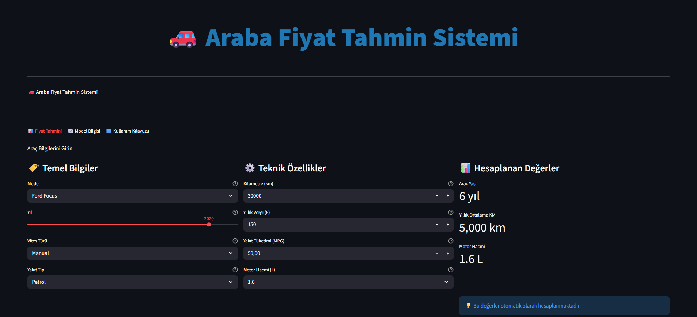
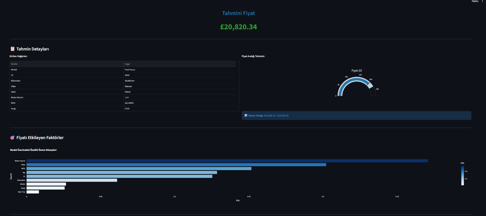
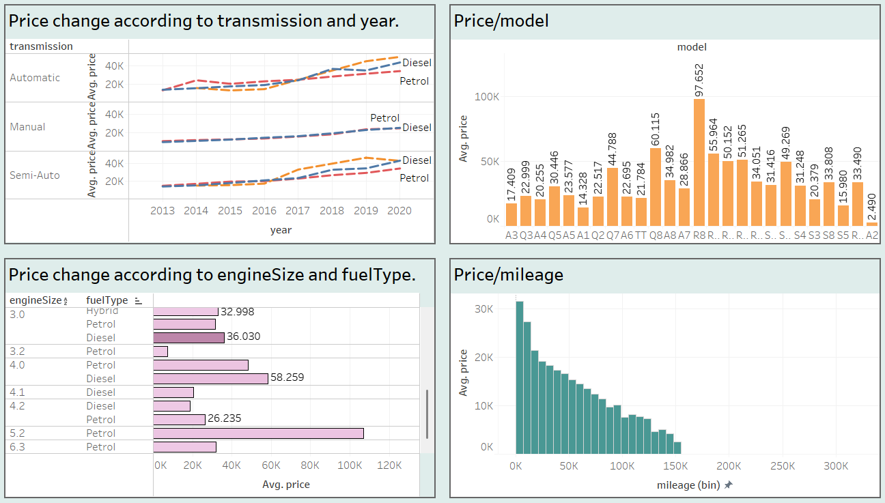
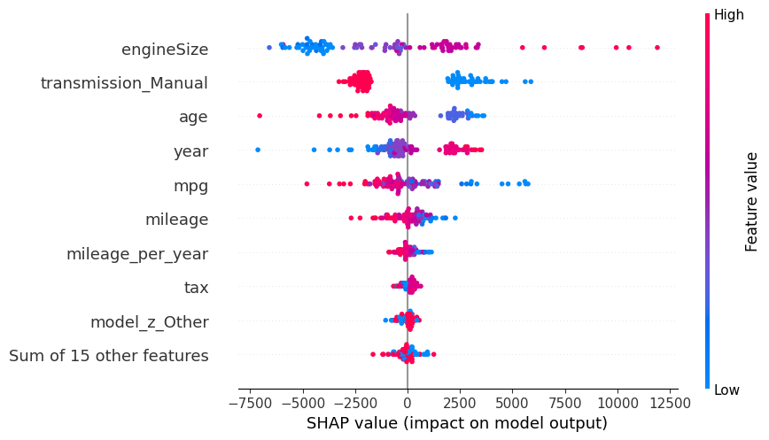
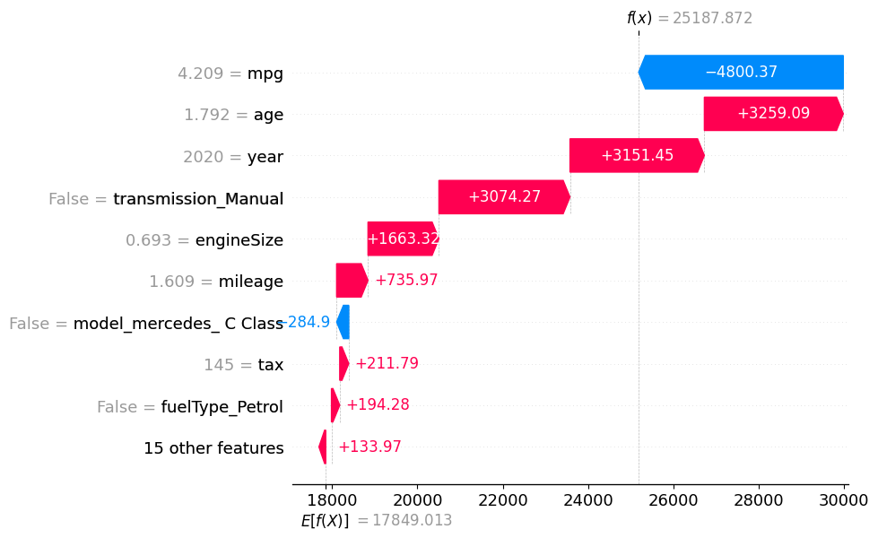

Harika bir portfolyo README dosyası hazırlayalım. Elinizdeki görseller (Streamlit arayüzü, SHAP analizleri, Feature Importance grafikleri ve Tableau) bu projeyi çok profesyonel gösterecek.

Aşağıda, görsellerin en etkili olduğu yerlere yerleştirildiği, **model dosyası uyarısını içeren** ve teknik derinliği ön plana çıkaran **hazır README.md** şablonunu bulabilirsin.

Bunu kopyalayıp projenin `README.md` dosyasına yapıştırabilirsin.

---

```markdown
# 🚗 Araba Fiyat Tahmin Sistemi (End-to-End ML Project)


Bu proje, İngiltere ikinci el araç piyasası verilerini kullanarak araç fiyatlarını tahmin eden kapsamlı bir makine öğrenimi ve veri analizi projesidir. Proje; veri temizleme, görselleştirme (Tableau), model eğitimi (Random Forest), model açıklanabilirliği (SHAP) ve web dağıtımı (Streamlit) aşamalarını kapsar.

## 📱 Uygulama Arayüzü

Kullanıcılar araç özelliklerini girerek anlık fiyat tahmini alabilir ve modelin güven aralığını görüntüleyebilir.

| Giriş Ekranı | Tahmin Sonuç Ekranı |
|:---:|:---:|
|  |  |
| *Kullanıcı dostu parametre giriş paneli* | *Tahmin sonucu, güven aralığı ve etki analizi* |

---

## 📊 Tableau Dashboard

Veri setindeki trendleri ve marka karşılaştırmalarını analiz etmek için interaktif bir Tableau panosu oluşturulmuştur.



> **Not:** Orijinal etkileşimli dosyayı incelemek için [tableau_dashboard.twbx](tableau_dashboard.twbx) dosyasını indirebilirsiniz.

---

## 🧠 Model Performansı ve Açıklanabilirlik (XAI)

Modelin kararlarını nasıl verdiğini anlamak için **SHAP (SHapley Additive exPlanations)** kütüphanesi kullanılmıştır. Bu, "kara kutu" modelleri şeffaf hale getirir.

### 1. Global Açıklanabilirlik (Beeswarm Plot)
Hangi özelliğin fiyatı nasıl etkilediğinin genel özeti:
- **Motor Hacmi (engineSize):** Hacim arttıkça (kırmızı noktalar) fiyat artar (sağa kayar).
- **Vites (Transmission_Manual):** Manuel vites (kırmızı) fiyatı düşürücü etkiye sahiptir.
- **Yaş (Age):** Araç yaşı arttıkça fiyat düşer.



### 2. Özellik Önem Düzeyleri (Random Forest)
Modelin eğitim sırasında en çok bilgi kazancı (information gain) sağladığı özellikler:


### 3. Yerel Açıklanabilirlik (Waterfall Plot)
Tek bir tahminin (örneğin 2020 model bir araç) neden o fiyata satıldığının analizi:



---

## 📋 Proje Özellikleri

- **Veri Seti:** Audi, BMW, Ford, VW, Toyota, Skoda, Hyundai, Mercedes markalarına ait 100,000+ araç verisi.
- **Algoritma:** Random Forest Regressor (`n_estimators=500`, `max_depth=20`)
- **Başarı Skoru (R²):** %93.49 (Test Verisi)
- **Hata Payı (RMSE):** ~£2,564

---

## ⚠️ Kurulum ve Çalıştırma (ÖNEMLİ)

GitHub dosya boyutu sınırları (100MB) nedeniyle, eğitilmiş model dosyası (`car_price_prediction_model.pkl`) bu repoda **bulunmamaktadır**. Projeyi çalıştırmak için modeli kendi bilgisayarınızda oluşturmalısınız.

### 1. Repoyu Klonlayın
```bash
git clone [https://github.com/KULLANICI_ADINIZ/Car_Price_Prediction.git](https://github.com/KULLANICI_ADINIZ/Car_Price_Prediction.git)
cd Car_Price_Prediction

```

### 2. Gerekli Kütüphaneleri Yükleyin

```bash
pip install -r requirements.txt

```

### 3. Modeli Eğitin (Zorunlu Adım)

`Car_Price_Prediction.ipynb` dosyasını Jupyter Notebook veya VS Code ile açın ve tüm hücreleri çalıştırın. Bu işlem sonucunda klasörünüzde `car_price_prediction_model.pkl` dosyası oluşacaktır.

### 4. Uygulamayı Başlatın

Model dosyası oluştuktan sonra terminalden şu komutu girin:

```bash
streamlit run app.py

```

---

## 📁 Dosya Yapısı

```
.
├── app.py                           # Streamlit Web Uygulaması
├── Car_Price_Prediction.ipynb       # Model Eğitim ve Analiz Notebook'u
├── requirements.txt                 # Kütüphane gereksinimleri
├── Datasets/                        # Ham veri setleri (csv)
├── tableau_dashboard.twbx           # Tableau proje dosyası
├── tableau_dashboard.png            # Dashboard görseli
├── model_columns.pkl                # Model sütun bilgileri
├── st1.png, st2.png...              # README görselleri
└── README.md                        # Proje dokümantasyonu

```

## 💡 Notlar

* Fiyatlar **Pound Sterling (£)** cinsindendir.
* Tahminler modelin test verisindeki başarısına dayanarak **%93** güven ile sunulur.

```

### Yapman Gerekenler:
1.  Bu metni kopyala ve `README.md` dosyana yapıştır.
2.  **Dosya İsimlerini Kontrol Et:** Kod içinde `st1.png`, `st2.png`, `Random Forest - Özellik Önem Düzeyleri.png` gibi isimler kullandım. GitHub repona yüklediğin resimlerin isimleri birebir böyle olmalı. (Özellikle boşluk karakterlerine dikkat et, gerekirse resim isimlerini `feature_importance.png` gibi basitleştirip README'yi güncelle).
3.  **Tableau Dosyası:** `tableau_dashboard.png` dosyasını repo ana dizinine attığından emin ol.
4.  **GitHub Linki:** "KULLANICI_ADINIZ" yazan yere kendi GitHub kullanıcı adını yaz.

```